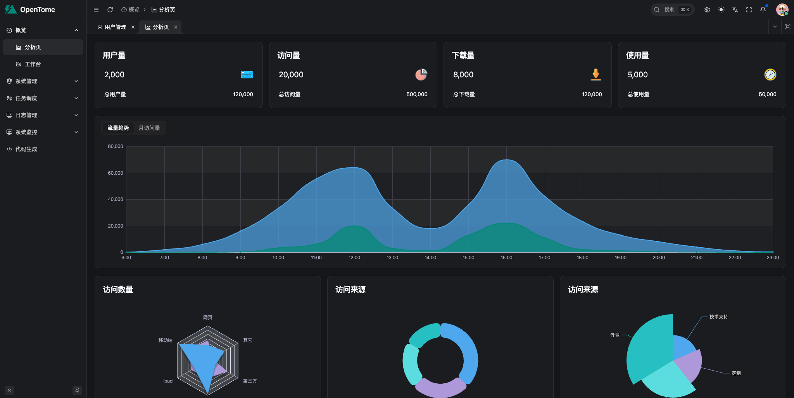
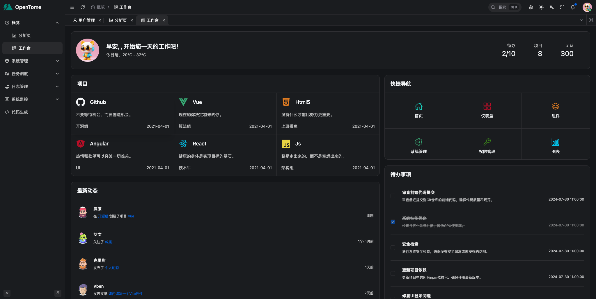
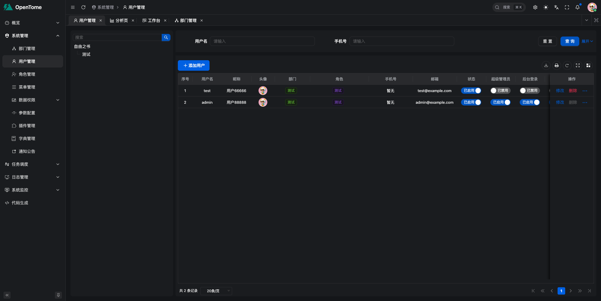
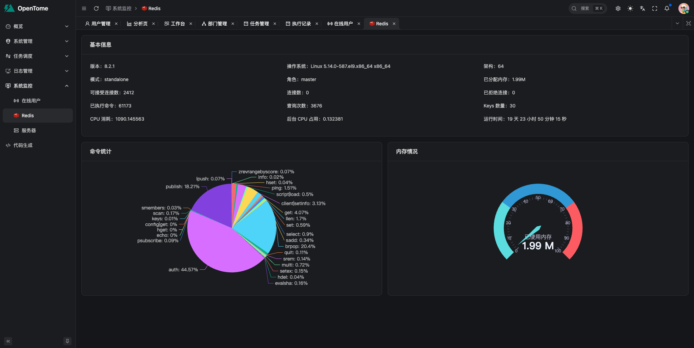

## fastapi-template

## UI






## Virtualenv

```
uv sync
.\.venv\Scripts\activate
```

## Init SQL

```
fba --sql  /Users/gaozhe/PycharmProjects/vpntool/fastapi-template/backend/sql/mysql/init_test_data.sql
fba --sql /Users/gaozhe/PycharmProjects/vpntool/fastapi-template/backend/plugin/dict/sql/mysql/init.sql
fba --sql /Users/gaozhe/PycharmProjects/vpntool/fastapi-template/backend/plugin/config/sql/mysql/init.sql
```

## Development

```
# 运行后端
fba run
# celery后端
fba celery worker
# celery定时任务
fba celery beat
# celery flower页面
fba celery flower
```

## Migrate

```
alembic revision --autogenerate
alembic upgrade head
```

## lint

```
pre-commit install
pre-commit run --all-files
```

## Acknowledgments

- [vue-vben-admin](https://github.com/vbenjs/vue-vben-admin)
- [fastapi_best_architecture](https://github.com/fastapi-practices/fastapi_best_architecture)
